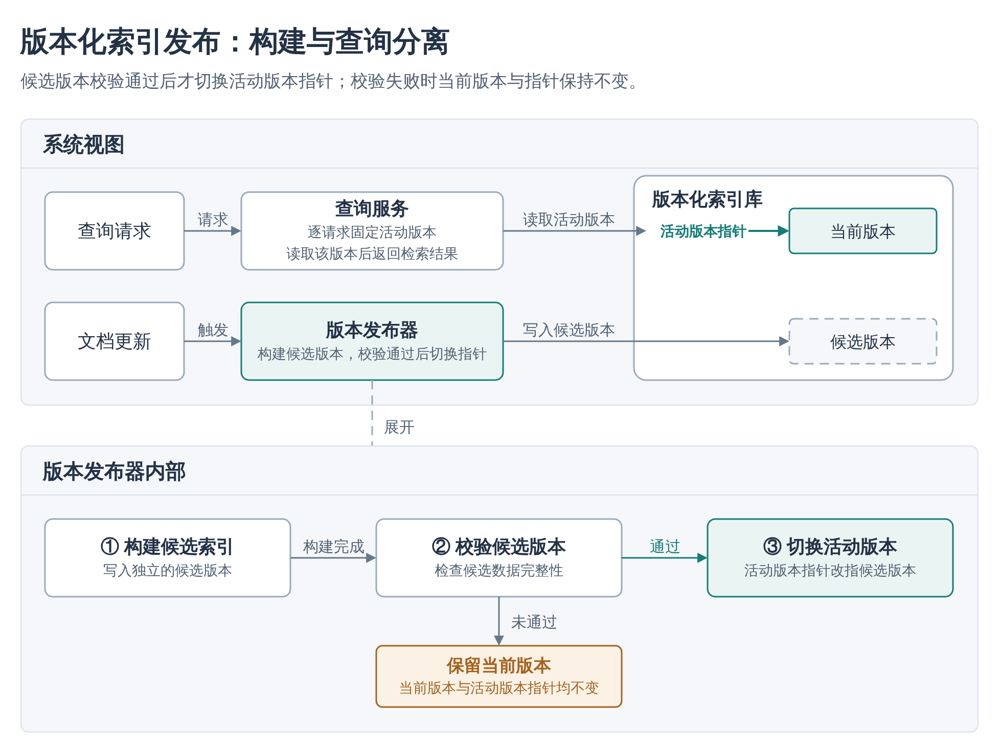
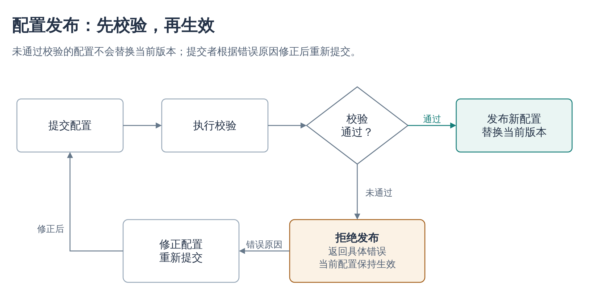
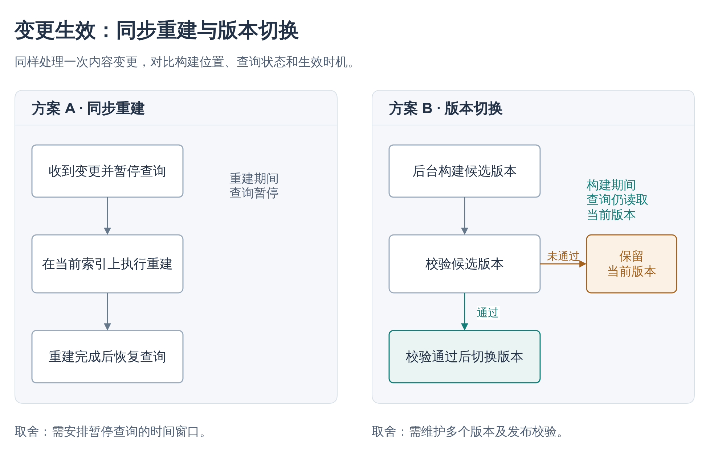

# Drawio Craft

把技术方案画成解释清楚、组织合理、视觉美观的原生 draw.io 图。

适合放在技术文档开头的方案图、机制说明、架构图、流程图和方案对比。图本身承担主要解释，帮助读者理解关键部分及其关系；保留后续在 draw.io 中修改文字、节点和连线的能力。

可用于 Codex 和 Claude Code。核心工作流不依赖生图、浏览器自动化、MCP 或在线渲染服务；Python 标准库脚本提供可选的源文件检查。



[编辑这个示例](assets/mechanism.drawio) · [查看 SVG](assets/mechanism.svg)

## 它如何画图

- **先组织解释。** 根据材料识别实体、动作、关系和关键条件，再决定用流程、分组、对比或局部展开来表达。
- **按阅读尺寸设计。** 字号、节点尺寸和画布一起安排，避免缩进文档后变成一堆小字。没有指定尺寸时，以约 1000 像素的文档显示宽度作为设计参考。
- **同时规划节点与连线。** 用共享行列、分区和预留走线空间组织画面，复杂回路按需要明确指定路径。
- **使用克制的视觉规则。** 中性色为主，强调色对应重点，兼顾中文标签、文字层级和有用途的留白。
- **保留信息与编辑能力。** 不按固定节点数裁剪，不为美化改变关系；局部修改尽量保留无关内容和人工调整。

可以输入一段说明、一份设计文档或已有 `.drawio`。信息不足且影响含义时才询问，不要求每次画图先完成一套问卷。已有配色或版式要求优先于默认样式。

## 安装

这是独立的 skill 仓库，不需要合并进已有的个人技能库。可以只在工作项目中启用。

### 只对指定项目启用

先把本仓库保存在一个固定位置。以下示例使用专门的工作技能目录：

```bash
mkdir -p "$HOME/.local/share/work-skills"
git clone https://github.com/xwysyy-studio/drawio-craft.git \
  "$HOME/.local/share/work-skills/drawio-craft"
```

在需要画图的项目根目录执行，按使用的 CLI 选择对应命令。目标位置如果已有同名 skill，先检查，不要强制覆盖。

**Codex：**

```bash
mkdir -p .agents/skills
ln -s "$HOME/.local/share/work-skills/drawio-craft" .agents/skills/drawio-craft
```

**Claude Code：**

```bash
mkdir -p .claude/skills
ln -s "$HOME/.local/share/work-skills/drawio-craft" .claude/skills/drawio-craft
```

两个 CLI 都使用时，可以建立两个入口，指向同一份源文件。这样不修改全局配置，也不把 skill 安装到全局发现目录。以上是本机链接；需要团队共享时，把完整 skill 目录放进项目对应位置，不提交指向个人电脑路径的链接。

也可以从 GitHub 的 **Code → Download ZIP** 下载，解压后将包含 `SKILL.md` 的完整目录复制到项目的 `.agents/skills/drawio-craft/` 或 `.claude/skills/drawio-craft/`。

安装位置和符号链接支持见 [Codex 官方说明](https://learn.chatgpt.com/docs/build-skills#where-codex-loads-local-skills)和 [Claude Code 官方说明](https://code.claude.com/docs/en/skills#where-skills-live)。公司管理策略可能限制自定义 skill，应遵守工作环境的规则。

### 调用

Codex：

```text
$drawio-craft 根据 docs/design.md 画一张方案示意图。
让读者主要看图就能理解关键机制，输出到 docs/figures/design.drawio。
```

Claude Code：

```text
/drawio-craft 根据 docs/design.md 画一张方案示意图。
让读者主要看图就能理解关键机制，输出到 docs/figures/design.drawio。
```

也可以明确给出用途或修改范围：

```text
美化这张 existing.drawio，保留全部模块、条件和连接关系。
重点调整过小的文字、拥挤的标签和交叉连线，使用浅色技术文档风格。
```

自然语言匹配也可以触发 skill；若没有出现，检查安装目录及 CLI 的技能列表，必要时开启新会话。普通网页对话可以读取 `SKILL.md` 及相关参考文件，但没有本地工具时无法自动运行校验或导出。

## 环境与交付

| 能力 | 用途 | 是否必需 |
| --- | --- | --- |
| 能读取说明并生成文件的模型 | 生成原生 `.drawio` | 核心能力 |
| Python 3.9+ | 检查、完整内容清单、解压原生页面 | 可选，无第三方 Python 依赖 |
| draw.io Desktop 或获准使用的编辑器 | 打开、编辑、导出 PNG / SVG / PDF | 查看或导出时需要 |
| 渲染结果与模型看图能力 | 检查实际排版、连线和缩放可读性 | 可选增强 |

主要交付物始终是 `.drawio`。导出图片后保留源文件；缺少渲染能力时如实说明未做画面验收。不得为了通过检查擅自上传公司文档、更换服务或安装工具。

## 本地检查工具

在本仓库目录执行：

```bash
python3 scripts/drawio.py check assets/mechanism.drawio --display-width 1000
python3 scripts/drawio.py inspect assets/mechanism.drawio
python3 scripts/drawio.py unpack compressed.drawio readable.drawio
```

- `check`：检查 XML、页面内 ID、父子关系、端点引用、数值和几何结构；提示可能的重叠、文字容纳问题、缩放后小字，以及明确指定的正交路径穿过节点的问题。`--json` 输出完整 JSON。
- `inspect`：输出各页完整的节点文字、分组和关系，不裁成 top-N。
- `unpack`：把压缩页面展开为可读 XML，保留全部页面和对象包装，不改输入文件，并拒绝覆盖已有目标。

支持原生 `mxfile`、单独的 `mxGraphModel`、多页及压缩页面。检查工具不解码图片中嵌入的图源；这类文件请先用 draw.io 保存为 `.drawio`。

**检查结果的边界：** 结构错误使命令返回非零状态；几何和文字警告需要结合实际图判断。脚本不重现 draw.io 的自动路由，也不测量真实字体，结构通过不表示图已美观或逻辑已正确。`--display-width` 使用内容范围与导出边距估计缩放，最终以实际插入文档后的画面为准。

## 更多原生示例

示例均为虚构的技术说明，展示布局方法，不代表真实系统实现或性能结论。

### 主流程、判断与修正回路



[可编辑源文件](assets/flow.drawio) · [SVG](assets/flow.svg)

### 在相同条件下比较方案



[可编辑源文件](assets/comparison.drawio) · [SVG](assets/comparison.svg)

## 维护与验证

`SKILL.md` 是运行入口，`references/` 保存按需读取的方法，`assets/` 保存原生示例及预览，`scripts/` 提供标准库工具。维护检查：

```bash
python3 -m unittest discover -s tests -v
```

涉及画面或生成行为的修改还应使用真实任务和原生 draw.io 渲染检查。CLI 测试不会证明模型每次都能画好；示例效果也不代表所有模型、字体和编辑器环境都得到相同结果。

## 来源与许可

参考项目与采用范围见 [SOURCES.md](SOURCES.md)。本仓库使用 [MIT License](LICENSE)，可以单独下载、使用和修改。
