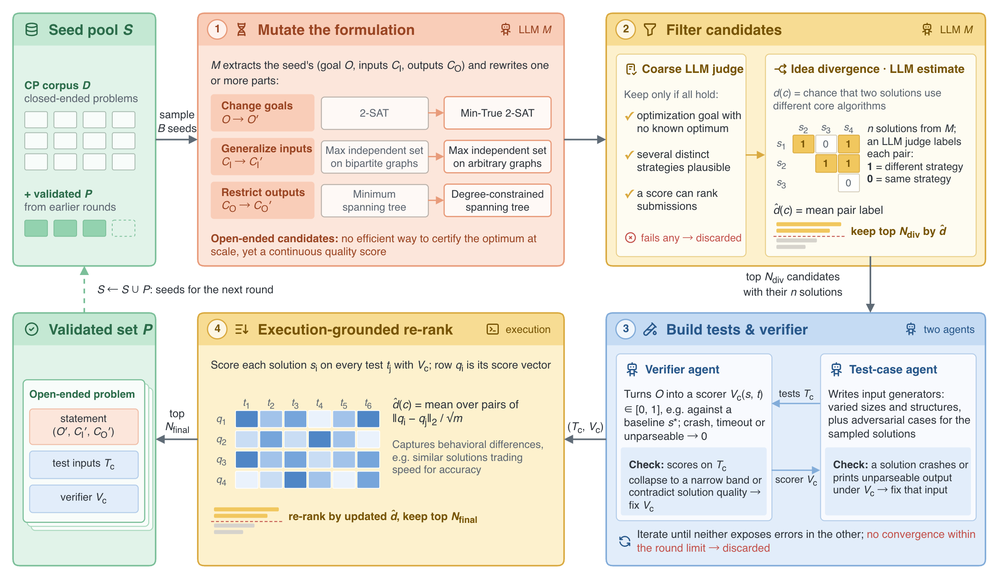

# diagram-craft

diagram-craft 指导模型绘制论文配图、架构图、流程图和方案示意图，目标是让内容清楚、画面好看，具有精心制作的 PPT 配图质感。设计判断适用于 draw.io、PPT 和图像生成，目前实际制作与检查主要覆盖 draw.io。

[技能入口](SKILL.md) · [参考图](references/examples.md) · [draw.io 制作要点](references/drawio.md)



[打开可编辑示例](examples/frontiersmith-claude/frontiersmith-pipeline.drawio)

## 整套指导怎样工作

图的用途决定信息取舍，内容关系决定呈现形式和空间，文字、图标、填色、边界与间距共同形成视觉层次。参考图为这些选择提供具体解法；实际成图则检验选择是否成立，并允许返回前面的环节重新安排。

| 环节 | 要解决的问题 | 与其他环节的关系 |
| --- | --- | --- |
| 图意与信息精度 | 读者需要理解什么，各项信息讲到什么程度 | 决定进入画面的对象、关系、条件和细节 |
| 图形表达与空间 | 用什么形式表现这些内容，各部分占多少面积 | 文字、图标、容器与阅读顺序一起安排 |
| 视觉层次 | 哪些对象应突出，哪些用于分组或辅助阅读 | 颜色、文字、边界、图标与留白共同配合 |
| 参考与实现 | 相似问题有哪些可用解法，如何在所选工具中落实 | 参考图提供有条件的设计经验，原生对象保留可编辑性 |
| 成图复核 | 内容是否准确，实际尺寸下是否清楚、协调、好看 | 可以调整信息详略、分区和整套样式，而不只修复溢出 |

具体绘图要求统一维护在 `SKILL.md` 及其引用的材料中。模块数、阅读方向、色彩组合和图形形式随内容决定。信息较多时，公式、代码、实例和关系本身可以成为图的主体；其阅读层次与用途共同决定应保留多少内容。

## 安装与使用

克隆完整仓库，保留参考图片及其相对路径：

```bash
git clone https://github.com/xwysyy-studio/diagram-craft.git
```

可以让能访问该目录的模型直接读取 `diagram-craft/SKILL.md`。需要作为本地 skill 启用时，将完整仓库目录放入所用工具支持的技能目录，并使用 `diagram-craft` 作为技能名。

### 文件

| 文件 | 用途 |
| --- | --- |
| [SKILL.md](SKILL.md) | 当前审美与设计指导，连接内容选择、构图、视觉关系和复核 |
| [参考图说明](references/examples.md) | 参考图的来源、评价范围及可观察做法，配套 20 张图片 |
| [draw.io 制作要点](references/drawio.md) | 原生容器、绑定连接、嵌入素材、字号线宽与导出检查 |

向执行模型提供完整 `diagram-craft/` 目录，保留相对路径和图片，再提供任务的原始材料、图的用途、读者、输出格式和已知展示尺寸。例如：

> 请读取 diagram-craft/SKILL.md，并按其中要求实际查看相关参考图片。根据所附材料，画一张解释该方法核心机制的 draw.io 图。交付原生可编辑文件和从该文件导出的预览，并在实际使用尺寸下检查。

图像生成需要实际接收选定的参考图、具体构图、准确标签、关系方向和风格要求。PPT 使用可编辑形状、组合与连接符。制作方式与素材处理见技能中的对应入口。

## 当前示例与评价范围

| 示例 | 内容与有用的观察 | 评价范围 |
| --- | --- | --- |
| [FrontierSmith，Claude 版](examples/frontiersmith-claude/frontiersmith-pipeline.png) | 实例对照、成对判断矩阵、执行得分矩阵与回流 | 最新浅白底版本获认可，用户明确更喜欢这一版 |
| [FrontierSmith，GPT-6 版](examples/frontiersmith-gpt6/frontiersmith-pipeline.png) | 同一输入下的另一种组织方式 | 最新浅白底版本保留作比较；偏好反馈指向上面的 Claude 版 |
| [Mem0](examples/mem0/mem0-architecture.png) | 对话、事实提取、相似记忆检索、更新操作和独立异步摘要 | 用户认可布局与内容，随后调整了边框与圆角；历史图仍含纯白卡片和实心编号 |
| [AetherCode](examples/aethercode/aethercode-pipeline.png) | 题目整理、两路测试构建、测试集合并与质量评估 | 保留按反馈修改布局、边框和颜色分布后的版本；尚未套用后来的浅白内卡处理 |

仓库为每个示例提供 `.drawio`、官方编辑器导出的 PNG、素材来源与许可。示例用于理解具体内容的组织方式，其局部样式仍按当前 skill 和新任务判断。参考图与素材的版权、许可归各自作者或项目。

## 验证范围

Mem0 与 FrontierSmith 的交付版由独立绘制的原稿加协调方修正得到。AetherCode 的交付版由另一个独立上下文在两张独立候选基础上重新构图，再按用户反馈修改。已有 draw.io 产物经过官方编辑器导出、图像查看和原生结构核对；这几项检查分别支持文件可用性、原生可编辑性和对实际画面的判断。

FrontierSmith 两个消费者获得一致的文字、skill 和素材输入，之后浅底由协调方调整。因此，最终浅底图是用户反馈修正后的结果，最新颜色指导尚未通过新的独立绘制运行验证。单次跨模型结果也不足以证明普遍的模型优劣或某次 skill 修改的因果效果。PPT 与 ImageGen 的实际出图效果尚未在本项目验证。

示例缩小后，部分次级说明仍需要放大阅读。用于论文或幻灯片时，应在实际版面检查；字体替换也可能改变换行。

## 仓库结构与许可

根目录的 `SKILL.md` 是技能入口，`references/` 保存制作指导与参考图，`agents/openai.yaml` 提供技能显示信息，`examples/` 保存原生示例、预览和素材来源。

原创技能文档与原创示例内容沿用 [MIT License](LICENSE)。第三方参考图片、图标和品牌标志保留各自的版权、许可及商标归属，不由本仓库重新授予 MIT 许可；来源与适用范围见 [SOURCES.md](SOURCES.md)。
