# 参考图

这些图用于校准整体观感，并看相似的问题怎样解决：内容怎样分块，图形和文字怎样分工，颜色、字重、描边和留白怎样配成一套，视线怎样移动。说明先写看得见的做法，部分图再写几处选择怎样配合、在什么条件下成立；这些是观察，不是用户打分的原因。使用时实际打开图片，理解其中的思路，不照搬某张图的布局、配色、字体或描边。

编号图来自用户打分的图库：1 分表示好看、符合审美，-1 分表示明显不适。评分针对整张图。好看的图也可能含有不必照学的局部，见下一节；被评为 -1 的图也不能归因到其中某一个单独效果。用户对几张参考图的原话各有所指，例如 InteractBench Figure 2 说的是布局和密度，飞书参考图说的是配色和多层模块的处理；这些评价只适用于所说的那张图和那个方面，不扩展成对某类颜色、形状或布局的通用许可或禁令。图片版权归原作者，仅作本地绘图参考。

## 原图做法与用户当前要求

下面的说明如实记录原图，其中有些做法与用户当前要求不同。使用参考时保留它们在信息组织上的作用，外观按用户要求处理：

- **模块底色**：#70、#108 和 BEST Figure 1 等图用实色标题条或实色模块配白字，#136 和 BEST Figure 1 等图用纯白内部卡片。新图按 SKILL.md 的颜色指导处理：标题条与主模块采用有分量的浅色配深色文字；承载内容的内部卡片默认用略带所属色相的浅白底，步骤块或实体按其在层次中的角色可以用更实一级的同色，一般不用不带色相的纯白。仍保留原图中标题与正文、主干与辅助对象的层次。
- **很深的外框**：InteractBench 两张图、#29、#89 用深色描边，#48 用粗黑线稿，它们与各自较重的字、图标和箭头配成一套。用户当前要求外层模块的边界相对内部更有分量、颜色与所在区域协调；在浅色模块图里把所有外框都画成近黑或藏蓝粗线，用户已经否定。采用这类风格时整套一起判断，不把深色粗框单独搬到新图上。
- **整图标题**：#89 中上方有带 logo 的大号项目名。用户默认不加整图大标题、副标题和图周围的备注，用户指定时照要求安排。

## 按用途挑选

| 图 | 内容 | 风格 |
| --- | --- | --- |
| [#13 AlphaEvolve](#13-alphaevolve) | 系统循环 | 清新 |
| [#29 The AI Scientist](#29-the-ai-scientist) | 多阶段流水线 | 清新 |
| [#52 Just-In-Time RL](#52-just-in-time-rl) | 两种方法对比 | 简洁 |
| [#104 Self-Distilled Policy Gradient](#104-self-distilled-policy-gradient) | 公式与训练目标 | 克制 |
| [#108 MoGe-3](#108-moge-3) | 网络结构 | 克制 |
| [#89 OpenClaw-RL](#89-openclaw-rl) | 系统架构 | 活泼 |
| [#70 GenColorBench](#70-gencolorbench) | 基准任务卡片 | 清新，PPT 感强 |
| [#136 三栏框架图](#136-三栏框架图) | 信息量大的方法总览 | 清新 |
| [#16 Qwen2.5-Omni](#16-qwen25-omni) | 多场景能力展示 | 活泼可爱 |
| [#101 Spreadsheet-RL](#101-spreadsheet-rl) | 数据构建与 agent 训练 | 活泼 |
| [#48 Alignment Pretraining](#48-alignment-pretraining) | 数据来源与结果对比 | 克制优雅 |
| [#139 机器人倒茶流程图](#139-机器人倒茶流程图) | 以真实照片为主的多阶段方法 | 清新 |
| [InteractBench Figure 1](#interactbench-figure-1) | 设定对比与多轮交互 | 活泼 |
| [InteractBench Figure 2](#interactbench-figure-2) | 多阶段构建流程与反馈 | 规整清新 |
| [BEST Figure 1](#best-figure-1) | 题目、方法与评测结果 | 克制务实 |
| [飞书参考图](#飞书参考图) | 两阶段数据构建 | 清新 |
| [#02 #113 #97 #143](#评分为--1-的对照) | 对照 | -1 |

## 评分为 1 的图

### #13 AlphaEvolve

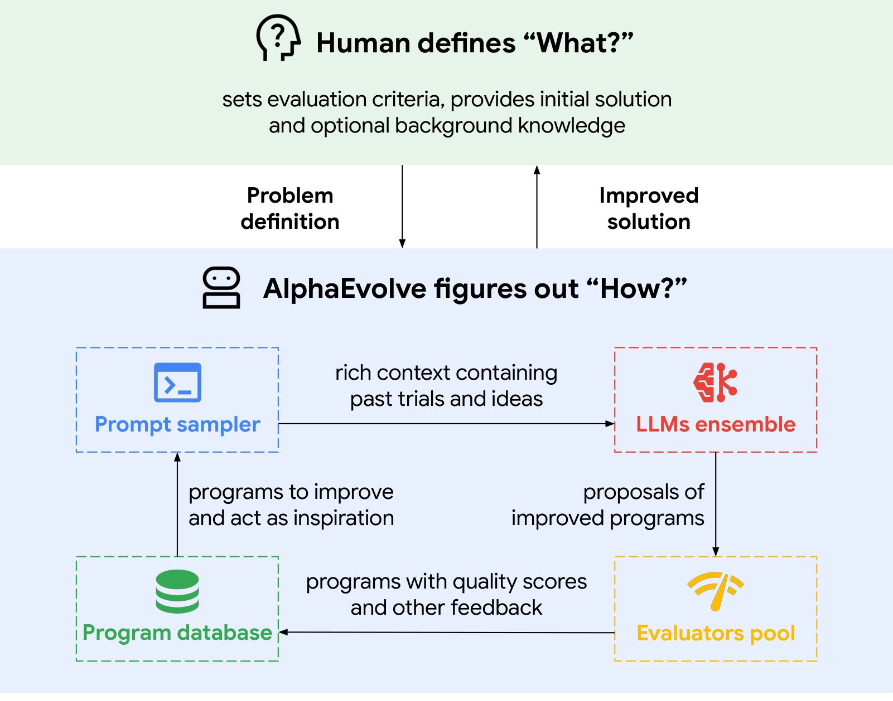

来源：*AlphaEvolve: A coding agent for scientific and algorithmic discovery*，Figure 1，arXiv 2506.13131。评分 1。

两条通栏浅色底带（浅绿、浅蓝）分别承载“人定义什么”和“系统怎样做”，带内标题配线性图标。四个组件是同色虚线框、同色图标和同色粗体名称（蓝、红、绿、黄），清楚的颜色只出现在线条、图标和文字上。组件之间是细黑箭头，箭头标签是完整的短句，例如 “programs with quality scores and other feedback”，字号接近组件名，交代循环里每一步传递什么，属于内容而不是备注。字大，留白多。两条底带很浅，但仍能看出绿和蓝；全图只有四个组件，颜色集中在虚线框、图标和粗体名称上，所以轻的底色不显得发虚。这种轻底色在元素少、字大的图里成立。

### #29 The AI Scientist

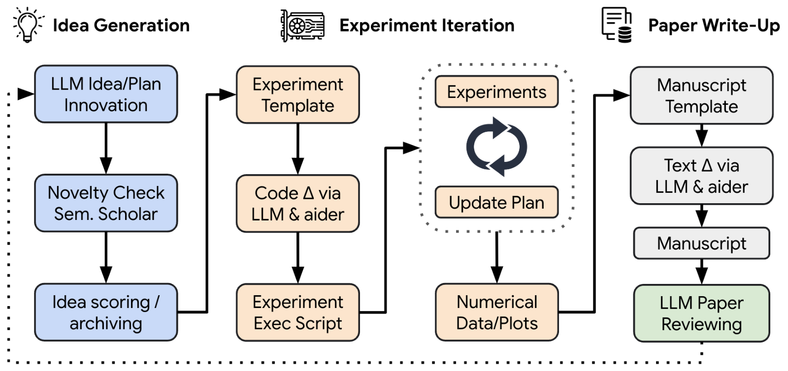

来源：*The AI Scientist: Towards Fully Automated Open-Ended Scientific Discovery*，Figure 1，arXiv 2408.06292。评分 1。

三个阶段各有图标和粗体列名，每个阶段一种颜色（蓝、杏、灰），最后的评审步骤用绿色。圆角框是深色描边加中浅填充，框内只有两三个词，字很大。正交箭头连接各列，点线表示迭代返回，虚线框包住循环部分。可以看颜色怎样按阶段分配，以及同级框的尺寸和字号怎样保持一致；深色描边、粗黑箭头和很大的字分量相当，阶段之间没有外框，只靠列标题、同色框和间距分开。

### #52 Just-In-Time RL

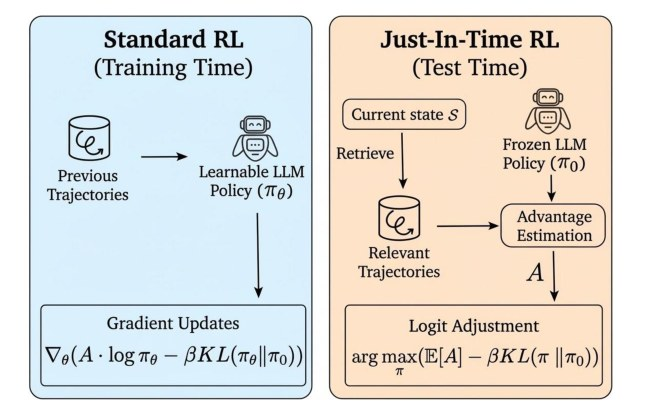

来源：*Just-In-Time Reinforcement Learning: Continual Learning in LLM Agents Without Gradient Updates*，ICML 2026 Spotlight，https://openreview.net/forum?id=pLvye0zHUC。图片经 Top-Conf Figure Gallery（github.com/qwdwqfwq/topconf-paper-figure-gallery）裁剪，按其图片政策以 CC BY 署名。评分 1。

两块圆角面板（天蓝、杏色），描边比填充深。面板内是粗体标题与副标题、线稿图标（数据库、机器人）和底部细线框里的公式。两边的标题和底部公式框位置对应，右侧多出检索、优势估计几步，差异处自然占了更多元素，一眼可见；全图元素很少。

### #104 Self-Distilled Policy Gradient

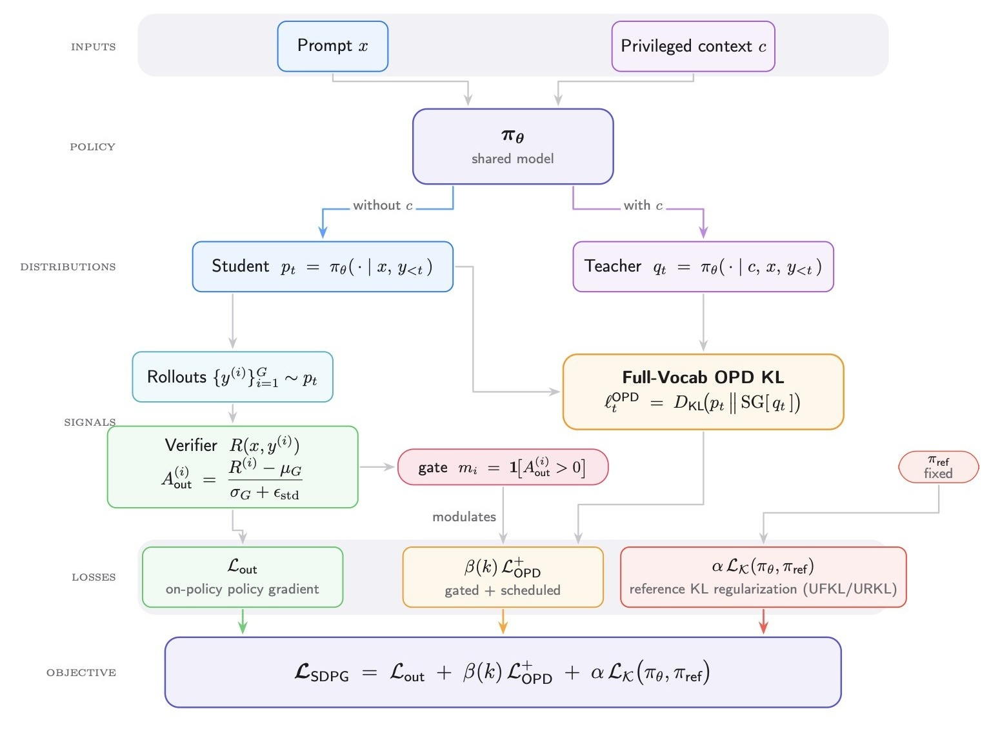

来源：*Self-Distilled Policy Gradient*，arXiv 2606.04036；图取自 https://x.com/yifanzhang_/status/2062405145821143085 。评分 1。

左侧小号大写行标签（INPUTS、POLICY、LOSSES 等）形成泳道，浅灰底带把同层对象托在一起。节点是彩色描边加同色极浅填充，不同颜色对应不同的量；公式直接写在节点里。连线是浅灰正交线，只有汇入最终目标的几段用彩色箭头。文字不少，但几乎都是公式和变量本身，按泳道分层后仍然好读。可以看克制风格中颜色怎样只承担区分，灰色连线怎样让节点成为主角。

### #108 MoGe-3

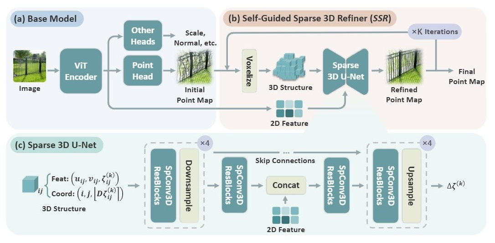

来源：*MoGe-3: Fine-Detail Monocular Geometry Estimation with Self-Guided Sparse Volumetric Refinement*，arXiv 2607.17967；图取自 https://x.com/zhenjun_zhao/status/2079424069083300289 。评分 1。

三部分使用三种很浅的底色（灰蓝、浅桃、浅青），各带同色胶囊标题。主体模块是同一青色系的实色块配白字，辅助操作用浅米绿块。连线是灰色，虚线框加 “×4” 表示重复结构，输入输出用真实照片和小型 3D 图。可以看较实的同色模块怎样给网络主干分量，同时让大面积底色保持轻；按用户当前要求，主干模块改用较实的浅色配深色字。

### #89 OpenClaw-RL

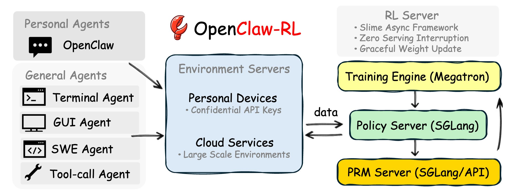

来源：*OpenClaw-RL: Train Any Agent Simply by Talking*，arXiv 2603.10165；图取自 https://x.com/LingYang_PU/status/2031895973123752013 。评分 1。

左侧灰底分组列表由线性图标和名称组成，中间是深色描边的天蓝面板，右侧三个服务用黄、绿、金黄填充加深色描边，中上方是带 logo 的大号项目名。手写风字体，字很大，只有几条箭头和一个 “data” 标签。颜色少、字大，一处明亮的黄色就让画面活泼起来。

### #70 GenColorBench

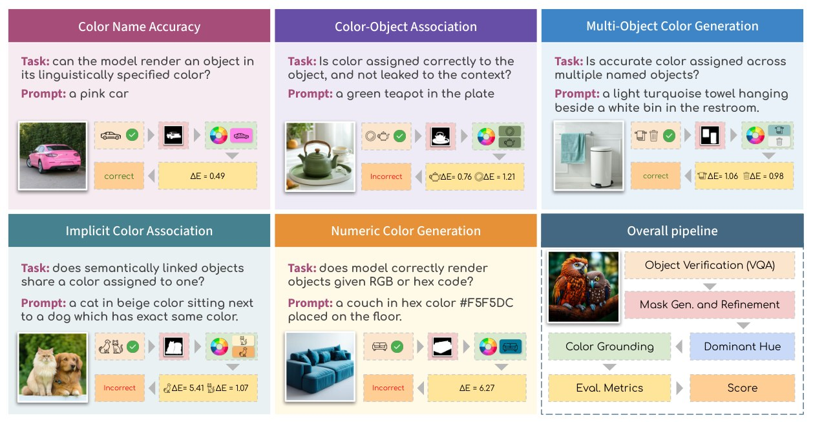

来源：*GenColorBench: A Color Evaluation Benchmark for Text-to-Image Generation*，CVPR 2026 Poster，https://openaccess.thecvf.com/content/CVPR2026/html/Butt_GenColorBench_A_Color_Evaluation_Benchmark_for_Text-to-Image_Generation_CVPR_2026_paper.html 。图片经 Top-Conf Figure Gallery 裁剪，按其图片政策以 CC BY 署名。评分 1。

六张同尺寸卡片排成两行。每张卡片是实色标题条配白字，正文区是同色的浅底；卡片内部结构一致，依次是任务、prompt、照片、图标化的步骤和结果。最后一张卡片用虚线框和浅色小块概括整体流程。内容不少，读者靠重复的卡片结构、较实的标题条和一致的内部次序知道先看哪里；六种色相对应六类任务。可以看标题条和同色浅底形成的两级层次，这种做法 PPT 感很强；按用户当前要求，标题条改用比正文区更实的浅色配深色字。

### #136 三栏框架图

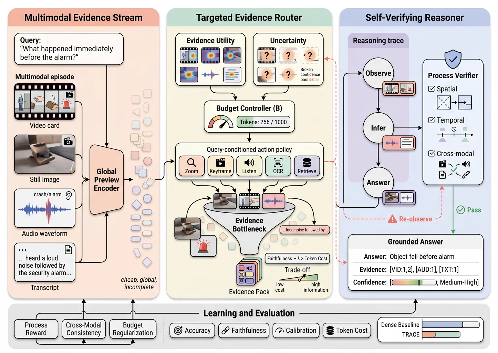

来源：小红书笔记“AI垂钓者”提示词系列，https://www.xiaohongshu.com/explore/6a5769c9000000000f01689b ；AI 生成的虚构论文插图，笔记未写明模型。评分 1。

三栏各有中等浅度的标题带（珊瑚、薄荷、长春花蓝），栏底是同色更浅的一级。白色小卡片带深色细描边，承载具体对象；照片、热力图、波形、仪表盘和图标替代大段文字。底部灰色横带放训练与评测。三栏内部的画法各不相同：左栏是纵向排列的媒体卡片汇入编码器，中栏是证据网格、预算仪表和动作按钮汇入漏斗，右栏是推理链与核验清单，每栏按本阶段要解释的机制选择画法。信息量大，但每块都有名字和固定位置，同级文字大小一致。

### #16 Qwen2.5-Omni

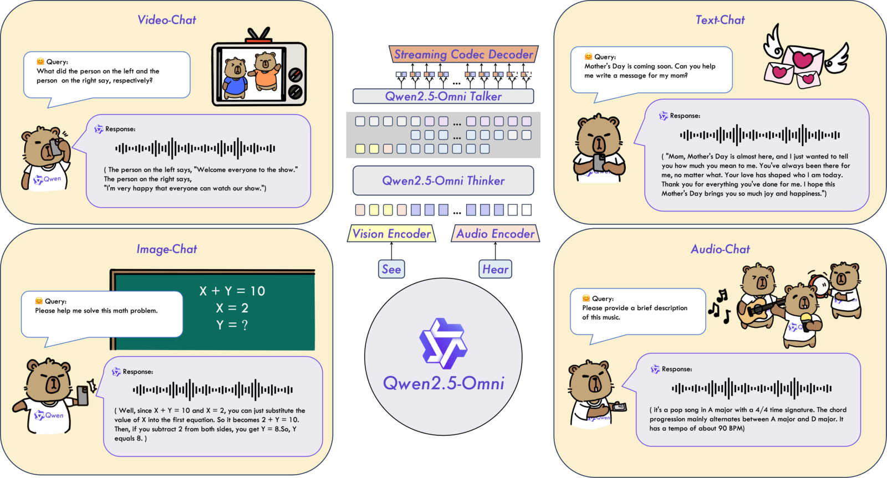

来源：*Qwen2.5-Omni Technical Report*，Figure 1，arXiv 2503.20215。评分 1。

四个奶油色大圆角面板配紫色描边和紫色斜体标题，对话气泡为白底或浅紫底、紫色描边，中间是模型结构的堆叠。棕色小熊吉祥物承担角色。奶黄和紫两种主色贯穿全图，活泼可爱而统一。气泡里的小字是示例内容本身。

### #101 Spreadsheet-RL

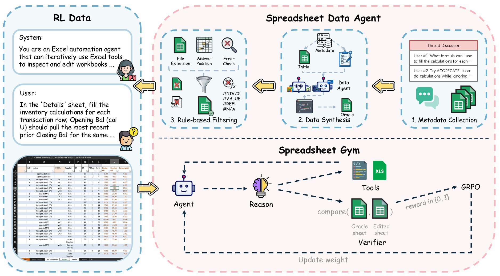

来源：*Spreadsheet-RL: Advancing Large Language Model Agents on Realistic Spreadsheet Tasks via Reinforcement Learning*，arXiv 2605.22642；图取自 https://x.com/MingyuanWu4/status/2059714896925987038 。评分 1。

蓝色虚线大圆角容器放 RL 数据，粉色虚线大容器放数据 agent 与训练环境，两者各带很淡的同色底，内部子步骤用同色虚线小框分组。Excel、文档、机器人等彩色扁平图标画法一致。黄色块箭头表示数据流，深色虚线表示训练回路。上排三个步骤按编号从右向左推进，由块箭头交代方向，阅读顺序不必总是从左到右。字体为手写风。

### #48 Alignment Pretraining

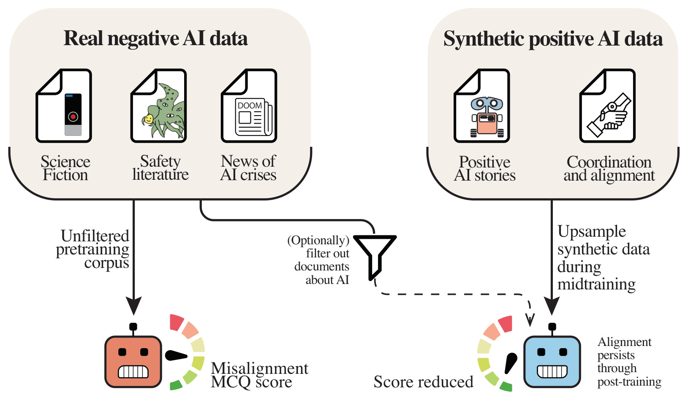

来源：*Alignment Pretraining: AI Discourse Causes Self-Fulfilling (Mis)alignment*，ICML 2026 Spotlight，https://openreview.net/forum?id=951OAanYyQ 。图片经 Top-Conf Figure Gallery 裁剪，按其图片政策以 CC BY 署名。评分 1。

两个暖灰色托盘形面板，底边是粗黑弧线，里面是文档图标，文档内的小插图带少量点色。其余是黑色粗线稿图标（漏斗、机器人、仪表）、衬线大字、黑色箭头和一条虚线分支。颜色几乎只出现在机器人（橙、蓝）和仪表刻度上。粗黑线稿、粗黑弧线、大号衬线字和黑色箭头一样厚重，整套分量一致；箭头标签是两三行的短语，说明每条路径做了什么。把其中的粗黑边单独套到轻细的字和图标上，不一定得到同样的效果。可以看克制风格怎样靠线稿和少量点色保持不冷。

### #139 机器人倒茶流程图

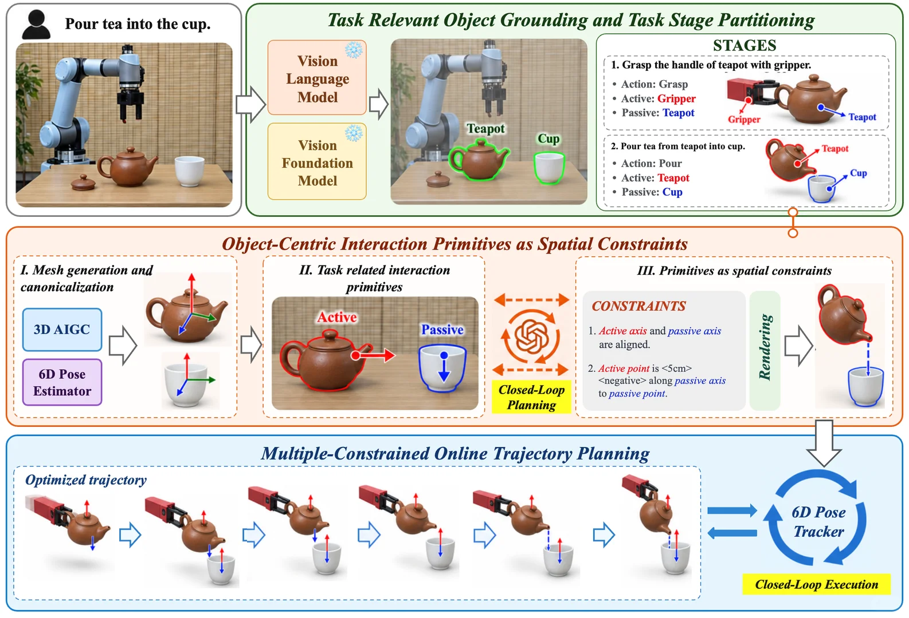

来源：小红书笔记 https://www.xiaohongshu.com/explore/6aa01e94000000001203c3c5 ；据笔记为 GPT Image 2 与 GPT-6 生成，未注明对应论文。评分 1。

三条通栏阶段带（绿、橙、蓝）用同色描边和很淡的同色底区分，斜体衬线标题用深一级的同色；通栏标题居中，子框标题靠左，对齐方式随层级和版式变化。内部虚线子框分出步骤。真实照片和机械臂、茶壶的渲染图是主体，红蓝箭头直接画在物体上表示约束，空心块箭头连接步骤。

## 用户自己的参考

这几张图直接体现用户的审美，与上面的图一起看，不作为模板。

### InteractBench Figure 1

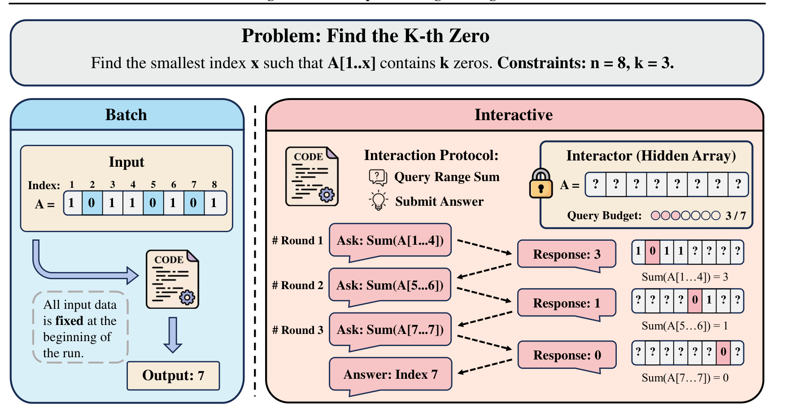

来源：用户自己论文 InteractBench 的 Figure 1，由用户绘制。用户形容它是可可爱爱、清清新新的红粉系。

顶部灰色题目条交代问题和约束。左侧 Batch 是天蓝标题带加更浅的蓝底，右侧 Interactive 是红粉标题带加浅粉底，同一色系两级深浅。输入区为奶油色，数组格子用色块直接显示数据状态；交互按轮次对齐请求气泡与响应气泡，虚线箭头往返；代码文档、灯泡、锁等图标帮助辨认。题目条里的 n = 8, k = 3 和数组的具体取值就是示例本身，所以精确写出；左下虚线框里的一句话交代 Batch 设定的关键条件，属于比较内容。可以看颜色怎样浅而有分量，以及概念怎样画成具体对象。深色粗描边、几乎全粗体和粗线图标构成较重的一套分量，这是这张图的个性。

### InteractBench Figure 2

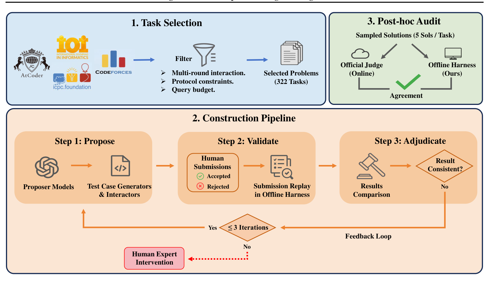

来源：用户自己论文 InteractBench 的 Figure 2，由用户绘制。用户评价它是中规中矩的蓝绿橙配色，布局规整，密度合理，既没有一堆小字和杂乱连线，也没有过空的内容。

三个编号区块中，构建流程获得下半部的整宽面积，独立的核查步骤放在右上的紧凑区域。杏色大区里是更深一级的杏色步骤卡，外层区块有深色描边，步骤卡不加描边，两层用不同方式区分；步骤间用橙色箭头；反馈沿下方返回，Yes、No、≤3 Iterations 等条件贴在线旁。竞赛平台用真实 logo，其他对象用线性图标；Proposer Models 用模型 logo，Human Submissions 和红框里的 Human Expert Intervention 写明由人参与，读者能分清哪一步由模型、哪一步由人完成。322 Tasks、5 Sols / Task 这类数字交代规模，短而具体。

### BEST Figure 1

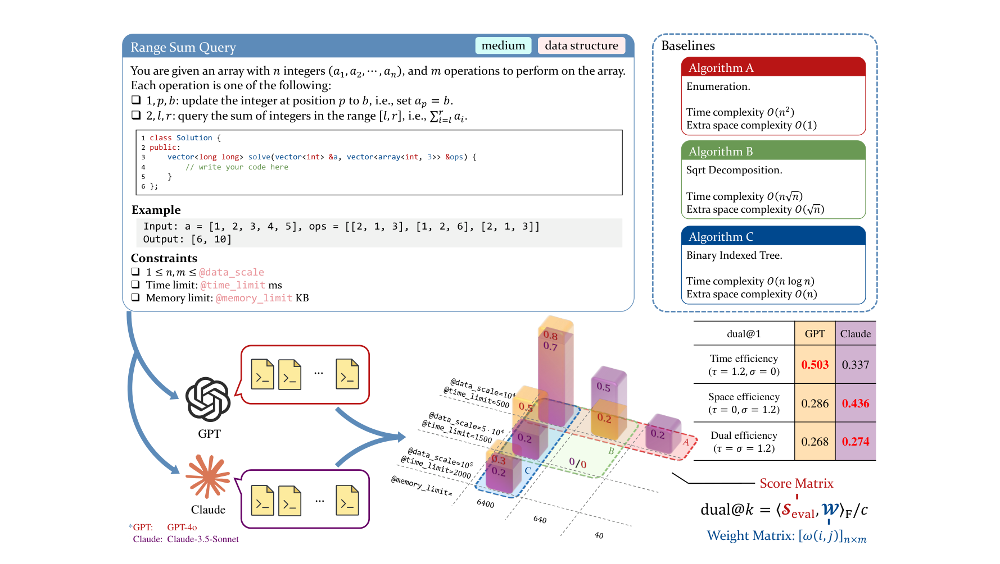

来源：用户学长的论文 BEST 的 Figure 1。用户很喜欢它的商务务实风：配色偏浅、不土、既不油腻也恰到好处，务实感来自整体质感，体现在空间关系和配色上。

上方题目卡用细的同色描边、实色窄标题条配白字和白色正文。右侧三张算法卡等宽等距，红、绿、深蓝标题条各对应一个算法。下方模型 logo、输出文件、三维柱图和结果表按评测关系展开。颜色主要出现在窄条和细线上，大面积是白底和留白。题面、代码模板和复杂度这些成段的技术文字留在图中，因为它们就是被评测的对象；卡片标题和正文靠左，像文档组件。图中只写 GPT、Claude，分数对应的具体模型版本放在左下角的注里。按用户当前要求，新图中的窄标题条改用浅色配深色字。

### 飞书参考图

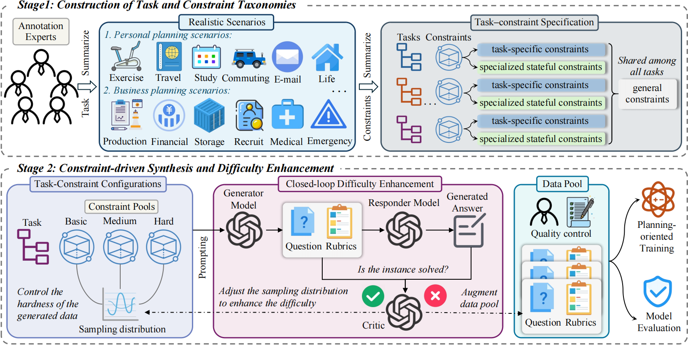

来源：用户在飞书文档中贴出的图，用户认可它的配色和多层模块的处理方式。

外层灰色虚线框组织两个阶段，阶段名是斜体标题。内部是不同浅色的实体面板，描边比填充深，面板名以标签压在上边框。对象用彩色图标和真实 logo 表示：Annotation Experts 和 Quality control 用人物图标，Generator、Responder 和 Critic 用模型 logo，人工环节和模型环节一眼可分。沿回路的 “Is the instance solved?” 等文字说明流程如何推进，属于箭头标签。可以看外层分组与内层对象怎样用不同的视觉方式区分。

## 评分为 -1 的对照

用来检查当前设计是否出现了类似的整体效果，不用于逐项归因。

### #02 Agentless

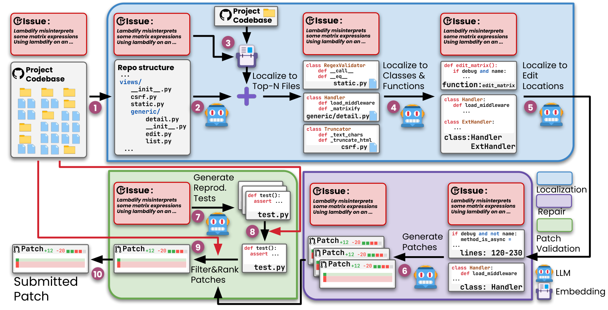

来源：*Agentless: Demystifying LLM-based Software Engineering Agents*，Figure 1，arXiv 2407.01489。评分 -1。

多个重复的粉红 “Issue” 方块里是斜体小字，代码片段、编号圆点和机器人图标密集排列；红色长折线穿过区域并相互交叉；蓝、绿、紫三块区域边界粗，内容拥挤。

### #113 CritICL

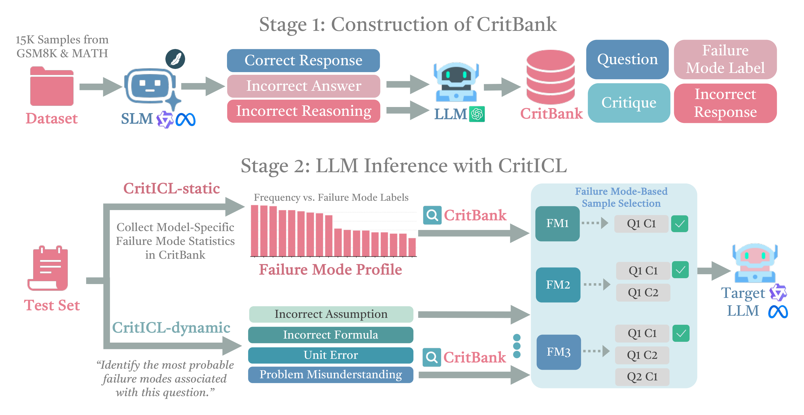

来源：*CritICL: Inference-Time Weak-to-Strong Generalization from Small Language Model Failure Modes*，arXiv 2608.27455；图取自 https://x.com/Zen_with_AI/status/2094099112681685284 。评分 -1。

颜色偏灰（灰粉、灰青、灰蓝），大量实心胶囊配白字，粗灰色块箭头，大号灰色衬线阶段标题。

### #97 Parallel-SFT

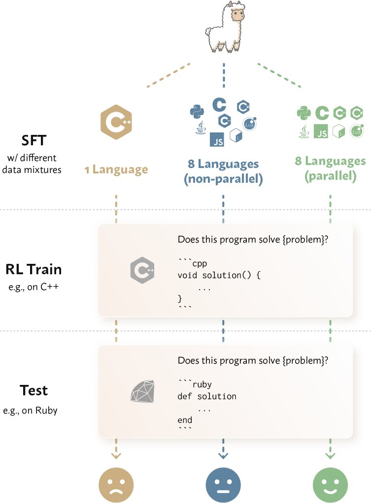

来源：*Parallel-SFT: Improving Zero-Shot Cross-Programming-Language Transfer for Code RL*，arXiv 2604.20835；图取自 https://x.com/zhaofeng_wu/status/2047331654578868249 。评分 -1。

卡其、灰蓝、灰绿等发灰的颜色，线条和卡片都很淡，带阴影的卡片与大片留白让内容发虚，重点不清。

### #143 Skill-Pro

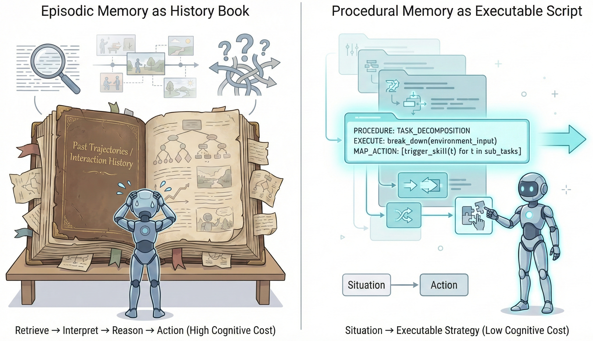

来源：*Skill-Pro: Learning Reusable Skills from Experience via Non-Parametric PPO for LLM Agents*，arXiv 2602.01869；据作者在小红书笔记评论区的回复，图由 ChatGPT 生成。评分 -1。

旧书材质、立体机器人和青色辉光占据画面，半透明界面叠放，接近插画海报。
